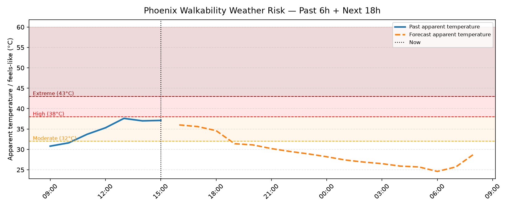

# Hi, I'm Protik Bose Pranto 👋

PhD student in Computer Science at Arizona State University, working at the intersection of geospatial AI, remote sensing, urban climate, and machine learning.

## What I work on
- Currently: Building machine learning and geospatial pipelines for urban climate research, including pedestrian infrastructure mapping, tree inventory generation, shade analysis, and heat vulnerability assessment.
- Interested in: GeoAI, remote sensing, computer vision, urban informatics, climate resilience, LiDAR analysis, and human-centered urban infrastructure planning.
- Open to: Research collaborations, internship opportunities, and projects related to AI for cities, climate, and geospatial intelligence.

## Phoenix Walkability Weather Risk — Live

> Auto-updated every 2 hours via GitHub Actions · Data: [Open-Meteo](https://open-meteo.com) · Location: Phoenix, AZ

📄 [View latest conditions →](walkability_weather.md)

Because a sidewalk is only useful when the climate allows people to walk. Tracks **feels-like temperature** (heat + humidity + sun + wind), not raw air temp — see the [latest report](walkability_weather.md) for thresholds and methodology.

## Reach me
- LinkedIn: [LinkedIn](https://www.linkedin.com/in/protik-bose-pranto)
- Email: [ppranto@asu.edu](mailto:ppranto@asu.edu)
- Website: [Portfolio](https://protikbose.github.io/)
- GitHub: [GitHub](https://github.com/protikbose77)
